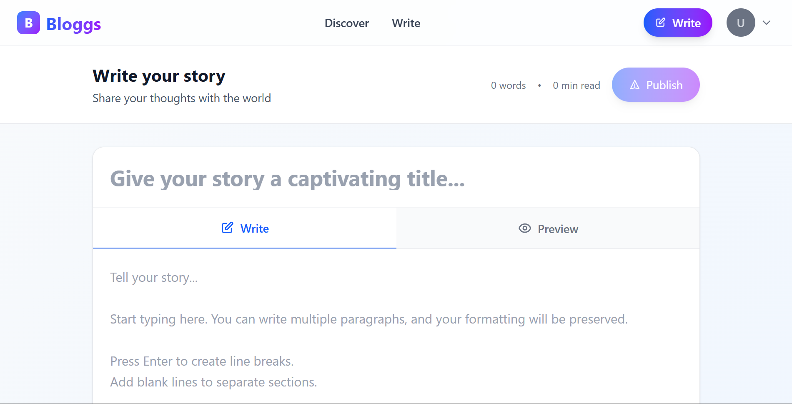

<p align="center">
  
</p>

# ✍️ Bloggs

**Bloggs** is a full-stack blogging platform where users can sign up, sign in, publish their own blogs, and read blogs written by others.  
It is built using modern web technologies with a scalable and clean architecture.

## 🚀 Overview

Bloggs is designed as a modern blogging website with a strong focus on:

- User authentication
- Content creation and publishing
- Clean separation of frontend, backend, and shared logic
- Type-safe validation using shared Zod schemas

The project follows a **monorepo-like structure**, making it easy to maintain and extend.

## ✨ Features

- ✅ User signup and signin
- ✅ JWT-based authentication
- ✅ Create and publish blogs
- ✅ Read blogs published by other users
- ✅ Secure backend API using Cloudflare Workers
- ✅ Shared validation logic between frontend and backend
- ✅ Scalable and modular project structure

## 🛠️ Tech Stack

### Frontend
- React
- TypeScript
- Deployed on **Vercel**

### Backend
- Hono (TypeScript)
- Prisma ORM
- Cloudflare Workers

### Database
- PostgreSQL

### Authentication
- JWT (JSON Web Tokens)

### Shared Validation
- Zod
- Published as an npm package: **@sumedh31/bloggs-common**

## 📂 Project Structure
```
├── frontend/ # React frontend (Vercel)
├── backend/ # Hono + Prisma + Cloudflare Worker
├── common/ # Shared Zod validations (published to npm)
├── screenshots/ # Project screenshots
├── README.md # Project documentation
```

## 📦 Common Package (Shared Validations)

The `common` folder contains **Zod validation schemas** that are required by both the frontend and backend.

Instead of duplicating validation logic, these schemas are:

- Published to npm as **@sumedh31/bloggs-common**
- Installed and imported like any other npm dependency
- Used by both frontend and backend for consistent validation

Example usage:

```ts
import { signupSchema } from "@sumedh31/bloggs-common";
```

This ensures:

- Type safety across the app
- Single source of truth for validations
- Cleaner and more maintainable codebase

---

### 🖼️ Screenshots

Below are screenshots of the Bloggs application:

### 🏠 Homepage


### 📰 Blogs Page


### ✍️ Write Section


### 🔐 Signup Page


--- 

### 🔐 Authentication Flow

1. User submits signup or signin form

2. Backend validates input using Zod (from @sumedh31/bloggs-common)

3. User data is stored securely in PostgreSQL

4. Backend generates a JWT token

5. Token is returned to the frontend

6. Frontend uses the token for authenticated actions (writing blogs, etc.)

---

### 🚀 Getting Started
**1️⃣ Clone the Repository**
```
git clone https://github.com/your-username/your-repo-name.git
cd your-repo-name
```
**2️⃣ Run Backend (Cloudflare Worker)**
```
cd backend
npm install
npx wrangler dev
```
**3️⃣ Run Frontend (Local)**
```
cd frontend
npm install
npm run dev
```
**Open:**
```
👉 http://localhost:3000
```
**4️⃣ Deploy Backend**
```
npx wrangler deploy
```

**5️⃣ Deploy Frontend**

- Connect your GitHub repository to Vercel

- Vercel will automatically deploy on every push to main
---
### 🧩 Future Enhancements

- ✨ Blog likes and comments

- 🧑‍💼 Author profiles

- 🔍 Search and tags

- 📊 Blog analytics

- 🛡️ Role-based access (admin / writer)
---
### 🤝 Contributing

**Contributions are welcome!**

1. Fork the repository

2. Create a new branch
```
git checkout -b feature/your-feature
```
   
4. Commit your changes
```
git commit -m "feat: add your feature"
```

6. Pust to your branch
```
git push origin feature/your-feature
```

8. Open a Pull Request 🚀

## 📬 Contact

For queries or suggestions:

GitHub: Sumedh-mhaske

Email: sumedhmhaske310503@gmail.com

# ⭐ If you like this project, don’t forget to give it a star!

